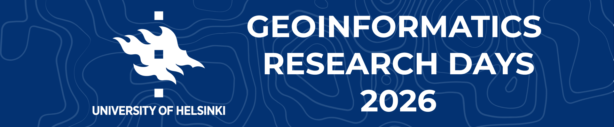

The *Geoinformatics Research Days* event is the annual gathering for geoinformatics experts in Finland, 
which has been arranged by the member universities of the 
**Finnish University Network for Geoinformatics (Fiuginet)** for over 10 years.

Traditionally, the Research Days have been a relatively small-scale event with mostly invited programme. However, in 2025
the *Geoinformatics Research Days* is arranged in in cooperation with `Location Based Services 2025 conference <https://lbs2025.lbsconference.org/>`_.
The LBS2025 conference will be held in Dipoli, Otaniemi, on 7-9 May. Because of this cooperation, the 2025 iteration of the Research Days will be held as a one-day event on 
**6 May, 2025**. 

The Research Days will act as a pre-event for the LBS2025 conference, and all LBS2025 participants are welcome to join us in the Research Days. 
Participants of the Research Days are also invited to join the LBS2025 conference (separate `registration required <https://lbs2025.lbsconference.org/pages/registration.html>`_).
In addition, the Geoinformatics Research Days 2025 will act as the final event of the `Geospatial Challenge Camp 2025 <https://challenge-camp.geoportti.fi/>`_.

The *Geoinformatics Research Days* event is the annual gathering for geoinformatics experts in Finland, 
which has been arranged by the member universities of the 
**Finnish University Network for Geoinformatics (Fiuginet)** for over 10 years.

Traditionally, the Research Days have been a relatively small-scale event with mostly invited programme. 
However, in 2023 *Fiuginet* made the decision to develop the event into a scientific conference, and therefore 
we are proud to announce the **Call for papers** for *Geoinformatics Research Days 2024*. 
The event will take place on May 20-21st, 2024 and will be organized by *Aalto University* together with the *Fiuginet* network, 
hosted in *Espoo, Finland.* The event is held together with the ICA Commission on Cognitive Issues in Geographic Information 
Visualisation with targeted sessions and their members are also warmly welcome.

We invite researchers, practitioners, and experts from academia, industry, and government sectors both in 
Finland and abroad to submit their research contributions for presentation during the *Geoinformatics Research Days 2024*. 
The conference will cover a broad spectrum of topics related to Geoinformatics, including but not limited to:

1. Geospatial Data Acquisition and Processing
2. Geographic Information Systems (GIS) and Remote Sensing
3. Spatial Data Analysis and Visualization
4. Geospatial Algorithms and Modeling
5. User Cognition in Geospatial Applications
6. Geoinformatic Human-Computer Interaction
7. Location-Based Services and Geographic Information Retrieval
8. Big Data Analytics for Geospatial Applications
9. Spatial Data Infrastructures and Interoperability
10. Geoinformatics for Smart Cities and Urban Planning
11. Environmental Monitoring and Geospatial Solutions
12. Geoinformatics for Sustainable Development
13. Geospatial AI and Machine Learning Applications
14. Open Geospatial Science and Open Source Software
15. Papers aimed at the programme related to the **ICA Commission on Cognitive Issues in Geographic Information Visualization**

Your participation in the *Geoinformatics Research Days 2024* will make a significant contributions, foster collaboration,
and shape the future of Geoinformatics. Together, let's advance the understanding and application of geospatial technologies 
for a more sustainable and interconnected world.

Submission guidelines
======================

Presenters are invited to submit an extended abstract of a maximum of 1000 words (approximately 2 pages of text) in English. 
In your paper please note if your paper is aimed at the ICA CogVIS programme track. 

All submitted papers will be peer-reviewed to ensure the quality of the contributions. 
All accepted publications will be given a chance to present their work at the *Geoinformatics Research Days 2024*.

.. attention:: 
    - Abstract `Submission Opens <https://easychair.org/my/conference?conf=grd24>`_: January 30th, 2024
    - Abstract submission deadline: March 8th 2024
    - Notification of acceptance: April 23rd 2024
    - Conference dates: 20-21 May

.. Paper submission
.. ================

.. Please submit your paper to the Geoinformatics Research Days using **Openconf**.

.. .. admonition:: Until ??? 2026 

..   .. button-link:: https://easychair.org/my/conference?conf=grd24
..       :color: primary
..       :shadow:
..       :align: center

..       👉 Submission!

Event registration
====================

.. admonition:: Fill this form! 

  Confirm your presence in the event by filling this form.

  .. button-link:: https://link.webropolsurveys.com/S/0CB43272A49318CD
      :color: primary
      :shadow:
      :align: center

      👉 Registration form!

Venue
======

To be announced.

Scientific committee
====================

To be announced.

Contact us
===============

.. grid:: 1

    .. grid-item-card:: :fas:`bell`

        For questions or further information, please contact us by email at **geoinfo-research-days@helsinki.fi**