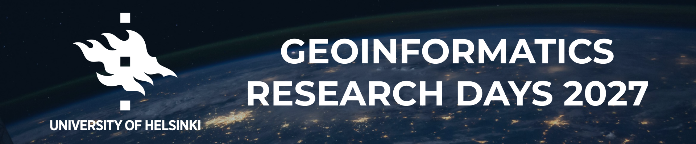
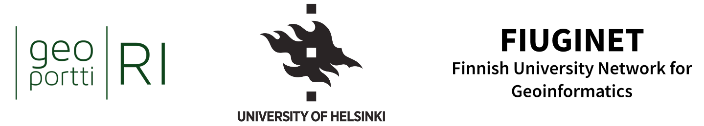

Geoinformatics Research Days 2027
======================

The *Geoinformatics Research Days* (GRD) event is the annual gathering for geoinformatics experts, 
which has been organized by the member universities of the Finnish University Network for Geoinformatics 
(`Fiuginet <https://www.geoportti.fi/services/skills-development/fiuginet/>`_) 
for over 10 years. The event will take place on **May 10-12, 2027**, and will be organized by University of Helsinki together 
with the Fiuginet network, hosted in Helsinki, Finland.

.. The program includes the **Final Event of the Geospatial Challenge Camp (GCC)**, where multidisciplinary 
.. teams of early-career researchers and students present solutions to real-world sustainability challenges using geospatial data and technologies. 
.. Learn more at the `Geospatial Challenge Camp website <https://challenge-camp.geoportti.fi/>`_.

Important Dates
=================

- Abstract Submission Opens: November, 2026, exact date TBA
- Abstract Submission Deadline: February, 2027, exact date TBA
- Notification of Acceptance: TBA
- Registration Opens: TBA
- Presenter Registration Deadline: TBA
- Registration Closes: TBA
- Conference Dates: May 10-12, 2027

Call for Abstracts
======================

TBA

.. Geoinformatics Research Days welcomes contributions from all areas of geospatial research and applications, providing an open platform 
.. for sharing ideas, methods, and innovations across the discipline. This year's **spotlight theme, Geospatial Intelligence for Sustainable 
.. Futures**, explores how emerging forms of spatial intelligence and AI are transforming our understanding of people, places, and the 
.. complex systems that connect them. We invite submissions that link AI-driven geospatial innovation with questions of sustainability, 
.. resilience, biodiversity, accessibility, and spatial justice across scales—from everyday mobility to global change.

Topics of Interest
-------------------

TBA

Submission Guidelines
----------------------

Presenters are invited to submit an abstract of a maximum of 300 words in English.

All submitted abstracts will be peer-reviewed to ensure the quality of the contributions. 
All accepted submissions will be given a chance to present their work at the *Geoinformatics Research Days 2027*.

Abstract Submission
--------------------
.. attention::

    Coming soon
    
    .. button-link:: 
            :color: primary
            :shadow:
            :align: center

            👉 TBA

Scientific Committee
====================

TBA

Program
========

TBA

Keynotes
----------

TBA

Venue
======

The event will be held at **Main Building, City Center Campus, University of Helsinki**, Helsinki, Finland. 

More details TBA

.. raw:: html

  

  

  <link rel="stylesheet" href="https://unpkg.com/leaflet@1.9.4/dist/leaflet.css" />
  

  

  

  

  

  

Registration
==============

.. Places are limited, so we encourage you to register early to secure your spot.

We warmly invite all interested in the field to participate, including researchers, industry professionals, 
public sector experts, and students.

Details TBA

.. **Registration is open until April 29, 2026.**

.. **Note:** Presenters must register by April 8, 2026.

Practical Information
==============

- **WiFi:** For connection instructions, see the `University WiFi Guide <https://helpdesk.it.helsinki.fi/en/help/11079>`_.
- **Accommodation & travel:** No support is provided. For visitor information and local recommendations, see the `University of Helsinki Visitor Guide <https://www.helsinki.fi/en/about-us/visit-us/guide-visitors>`_.

More details TBA

Contact Us
===============

.. grid:: 1

    .. grid-item-card::

        For questions or further information, please contact us by email at **geoinfo-research-days@helsinki.fi**

Event Partners and Sponsors
===============

.. .. toctree::
..    :maxdepth: 2
..    :caption: Contents:
..    :hidden:

..    Parallel Sessions <pages/parallel_sessions>